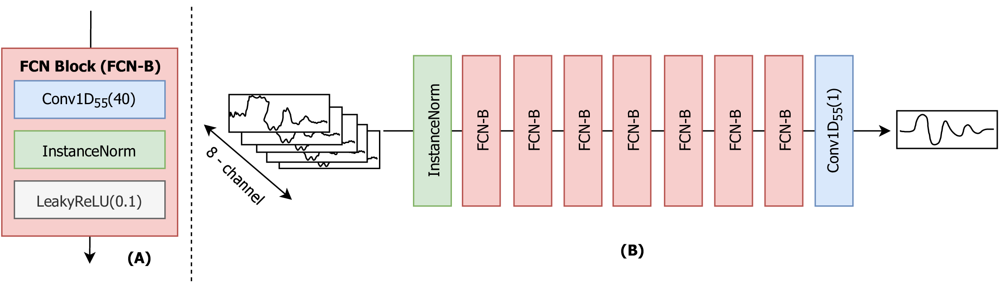
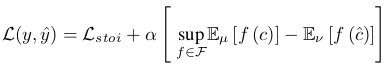

# SE3D

**tl;dr**: **2nd place solution** at L3DAS21 challenge Task 1. Using FCN architecture and PFPL + STOI Loss.

## Abstract

> Noise in 3D reverberant environment is detrimental to several downstream applications. In this work, we propose a novel approach to 3D speech enhancement directly in the time domain through the usage of Fully Convolutional Networks (FCN) with a custom loss function based on the combination of a perceptual loss, built on top of the *wav2vec* model and a soft version of the short-time objective intelligibility (STOI) metric. The dataset and experiments were based on Task 1 of the L3DAS21 challenge. Our model achieves a Short-Time Objective Intelligibility (STOI) score of 0.82, Word error rate (WER) equal to 0.36, and a score of 0.73 in the metric proposed by the challenge based on STOI and WER ponderation using as reference the development set. Our submission, based on this method, was ranked second in Task 1 of the L3DAS21 challenge.

## Model Overview


## Loss function

The Loss function is the key component in this work. Hsieh et al. proposed a Phone-Fortified Perceptual Loss (PFPL) derived on the latent representations of the *wav2vec* model, a self-supervised encoder with rich phonetic information.

In a similar way, we modified the original PFPL to use a STOI Loss component instead of the proposed *MAE loss*. The equation is described bellow.



For the challenge submission we used *alpha* = 5. For small values of *alpha*, the PFPL + STOI-LF and STOI-LF are almost identical since the STOI-LF is predominant in the total value of the loss function. A *alpha* = 1000 resulted in better metrics.

To use this loss function you need to download the weights from the wav2vec model [here](https://dl.fbaipublicfiles.com/fairseq/wav2vec/wav2vec_large.pt) and place the file and the folder *models*. The folder structure should look like the scheme bellow.

```bash
├── models/
   ├── wave2vec_large.pt
```

## Data

Download the files [here](https://zenodo.org/record/4642005) and unzip them at the dataset folder.

By the end of the process your folder should look like the structure bellow.

```bash
├── dataset/
   ├── L3DAS_Task1_dev
   ├── L3DAS_Task1_test
   ├── L3DAS_Task1_train100
   ├── L3DAS_Task1_train360
```

## Requirements

The dependencies can be installed through pip via the requirements.txt file.

```bash
pip3 install virtualenv
virtualenv --python=python3 .venv
source .venv/bin/activate
pip3 install -r requirements.txt
```

## Run

```bash
cd src/
python train.py ../config/config.yaml
```

## Citation

```latex
@inproceedings{guimaraes2021optimizing,
  title = {Optimizing Time Domain Fully Convolutional Networks for 3D Speech Enhancement in a Reverberant Environment Using Perceptual Losses},
  author = {Guimar{\~a}es, Heitor R. and Beccaro, Wesley and Ram{\'\i}rez, Miguel A},
  booktitle = {2021 IEEE 31st International Workshop on Machine Learning for Signal Processing (MLSP)},
  pages = {1--6},
  year = {2021},
  organization = {IEEE},
}
```
